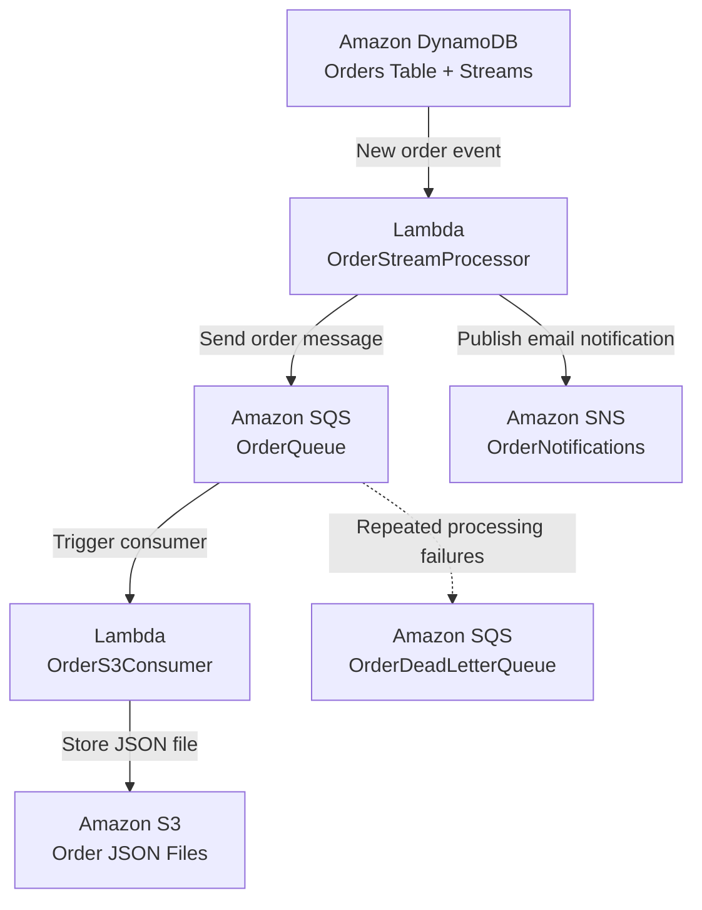

# AWS Event-Driven Order Ingestion Architecture

```mermaid
flowchart TD
    A["Amazon DynamoDB<br/>Orders Table + Streams"]
    B["Lambda<br/>OrderStreamProcessor"]
    C["Amazon SQS<br/>OrderQueue"]
    D["Lambda<br/>OrderS3Consumer"]
    E["Amazon S3<br/>Order JSON Files"]
    F["Amazon SNS<br/>OrderNotifications"]
    G["Amazon SQS<br/>OrderDeadLetterQueue"]

    A -->|New order event| B
    B -->|Send order message| C
    B -->|Publish email notification| F
    C -->|Trigger consumer| D
    D -->|Store JSON file| E
    C -.->|Repeated processing failures| G
```
